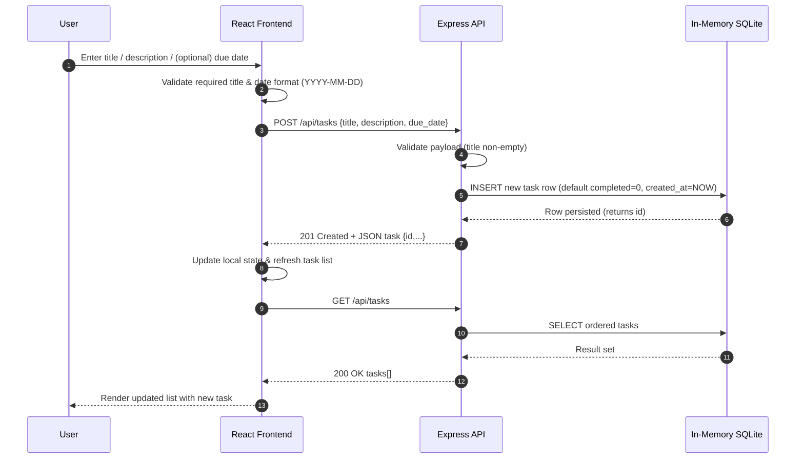

# Cloud / System Architecture Overview

This document provides a high-level system context for the TODO application monorepo. Although the current implementation runs locally (dev container) with an in-memory data store, the diagram illustrates logical boundaries that could map to cloud services in a production deployment.

## Summary
- Frontend: React SPA served to the user's browser (`packages/frontend`).
- Backend: Express.js API (`packages/backend`) exposing REST endpoints under `/api/tasks`.
- Data Store: In-memory SQLite (via `better-sqlite3`) initialized on server start (ephemeral).
- Persistence: Currently non-durable; data lost on restart. (PRD calls for local-only storage—this backend layer is an implementation variant.)

## System Context Diagram
```mermaid
flowchart LR
  User((End User)):::actor --> Browser[Web Browser]
  Browser --> Frontend[React SPA<br/>(packages/frontend)]
  Frontend --> API[Express REST API<br/>(packages/backend)]
  API --> DB[(In-Memory SQLite DB<br/>:memory:)]

  classDef actor fill:#1976d2,color:#fff,stroke:#0d47a1;
```

## Component Boundaries
| Layer | Responsibility | Notes |
|-------|----------------|-------|
| Browser (User) | Renders SPA, triggers interactions | Stateless between requests except local cache/session. |
| React Frontend | UI, form handling, fetches tasks | Potential future: localStorage fallback per PRD. |
| Express API | Validation, CRUD for tasks | Could evolve into persistent layer (Post-MVP). |
| SQLite (In-Memory) | Temporary task storage | Replace with durable DB (e.g., Postgres) in cloud scenario. |

## Data Flow (MVP Variant)
1. User enters task details in the form.
2. Frontend sends POST `/api/tasks` with JSON body.
3. API validates, inserts into in-memory SQLite, returns created task.
4. Frontend refreshes task list via GET `/api/tasks`.
5. Updates (PUT/PATCH/DELETE) follow similar request-response pattern.

## Potential Cloud Mapping (Future)
| Current Component | Cloud Equivalent |
|-------------------|------------------|
| React SPA | CDN + Static Hosting (e.g., S3 + CloudFront, Vercel, Netlify) |
| Express API | Containerized service / Serverless (AWS ECS/Fargate, Lambda + API Gateway) |
| In-Memory SQLite | Managed DB (AWS RDS Postgres / DynamoDB) |

## Non-Functional Considerations
- Ephemeral data means no multi-user consistency today.
- No authentication or authorization boundary yet.
- Single process; horizontal scaling not applicable in current design.

## Future Enhancements (From PRD / Docs)
- Local-only persistence (frontend `localStorage`) as an alternative to backend.
- Priority, due-date filtering logic can reside entirely client-side.
- Advanced sorting could move to database layer if persisted.

---
Document version: 2025-11-04 Initial draft.

## Task Creation Sequence
The following sequence illustrates the lifecycle of creating a new TODO item through the current React + Express + in-memory SQLite stack.


